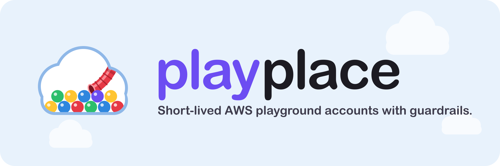

  

# playplace

A tool for an engineering organization to hand out short-lived AWS
"playground" accounts with guardrails: an owner, an expiry, a budget, and an
approval before anything is created. This README is the design and
development guide. User documentation is the site under `docs/`, served with
`task docs`.

## Build

Needs Go and [Task](https://taskfile.dev). Versions are pinned in `mise.toml`.

    task tools   # once, installs templ
    task build   # writes bin/playplace
    task test
    task --list  # everything else

## Documentation site

    task docs        # http://localhost:8000 with live reload
    task docs:build  # writes ./site

The site is built by [Zensical](https://zensical.org) through `uv` from the
pages under `docs/`: an overview, guides for requesters and approvers, the
CLI and configuration references, and the deployment guide, which includes
`deploy/README.md` as it is. Design notes stay here.

# Design

## Principles

- **No state.** The Playground OU says which accounts exist; tags on each
  account say everything else. Anything not derivable from AWS is not kept,
  except an optional write-only history log. See "No state file".
- **Management account only.** The tool holds management-account
  credentials and never assumes a role into a playground account. What runs
  inside an account is somebody else's concern.
- **Every account starts as an approved request.** Requests wait as tags on
  the OU. Approval, not creation, is the human step, because a created
  account cannot be closed for four days and counts against quota.
- **Guardrails are data, not code paths.** Owner, expiry, budget, and the
  approval trail are tags. Ceilings and limits are configuration.
- **Cost Explorer bills per call.** Nothing polls it. Views cache for an
  hour; `list` never touches it.

### No state file

There is no database and no state file. The playground OU decides which
accounts are playgrounds, and tags on each account hold the rest:

| tag | meaning |
|---|---|
| `playplace:managed` | `true` once the tool has tagged the account |
| `playplace:owner` | who is responsible |
| `playplace:expires` | RFC3339 expiry |
| `playplace:budget` | monthly budget in USD |
| `playplace:warned-at` | set once the owner was warned about expiry |
| `playplace:close-requested` | close intent, kept until AWS accepts the close |
| `playplace:access` | Identity Center principal the owner's access was granted to |
| `playplace:requested-by`, `playplace:approved-by`, `playplace:purpose` | audit trail from the request |

Pending requests are tags on the Playground OU itself, keyed `playplace:req:<name>`.
AWS allows 50 tags on a resource, so the queue holds at most 50 requests,
pending and approved-but-not-yet-placed together, less any other tags on the
OU. A request past that is refused with a message saying so.

A name whose account was closed cannot be requested again while the closed
account is still listed, because AWS never frees a root email and the email
is derived from the name. `create --email` with a fresh address is the way
around it.

Everything stored in a tag obeys AWS's rules: values up to 256 characters made
of letters, numbers, spaces, and `_ . : / = + - @`. Purpose is capped at 120
characters so the request record fits. Owners, requesters, and purposes are
checked on the way in and refused with a message that names the rule.

Everything else is read live: account status from Organizations, in-flight
and failed creations from `ListCreateAccountStatus`, spend from Cost Explorer.
Accounts that land in the OU without tags are adopted with defaults on the
next refresh. Cost Explorer bills per call, so `list` never touches it;
`show`, `costs`, the TUI, and the web UI cache results for an hour.

### Lifecycle

Statuses are derived, never stored:

    pending    a request waiting for an approver (a tag on the OU)
    creating   a creation request AWS has not finished
    failed     a creation request AWS rejected (kept 7 days)
    active     in the OU with no warning or close tag
    expiring   the warned-at tag is set
    closing    the close-requested tag is set and AWS has not accepted the close
    closed     AWS reports the account suspended or closed

AWS lets you close 20% of member accounts or 250, whichever is higher, per
rolling 30 days (capped at 1000, at most 3 closures in flight), and a new
account cannot be closed for its first 4 days. A refused close leaves the
intent in the tag and each refresh retries.

### Requests and approval

Every account starts as a request, and every request needs an approver who is
not the requester. Pending requests live as tags on the Playground OU, one tag
per request, so the CLI, TUI, web UI, and Slack all see the same queue with no
database. A request records owner, TTL, budget, purpose, who asked, and when.
Approving marks the record approved first and requests the account second,
so a second approver, in the same process or another, finds nothing pending.
If AWS refuses the creation the mark is removed and the request is pending
again. Within one process the refresh pass and every change to the queue are
serialized, so the worker, the web UI, and Slack never run the same pass or
act on the same request at once. The account carries `requested-by` and
`approved-by` tags for audit. Requests nobody acts on expire after
`--request-ttl` (7 days).

Guardrails applied at request time: the name must be free, the owner must be
an Identity Center user when `--permission-set` is set, one person may hold
at most `--max-per-owner` open accounts plus pending requests (default 1),
and a request may ask for at most `--max-ttl` (90d) and `--max-budget` ($500).
Only admins can exceed the two ceilings: the override checkbox in the web
form, or `--override-limits` on the CLI. The override is recorded on the
request, shown to approvers, and carried into the account when approved.

The lifetime ceiling holds after approval too. An extension may not push an
account's expiry past `--max-ttl` counted from when it was created, so
repeated extensions cannot walk around the limit. Admins may go past it: in
the web UI every admin extend is an override, on the CLI and in the TUI it
is `--override-limits` or the override field in the form. Each extension is
written to history with whether the ceiling was overridden.

Who may approve:

- in the web UI, emails in `--approvers` and `--admins`
- in Slack, the same people, identified by their Slack email
- on the CLI and in the TUI, whoever holds management credentials; their
  identity is recorded from `PLAYPLACE_OPERATOR` or the local user and host,
  and it is also the requester of anything they queue, even for someone else

Admins can edit a pending request before approving it: owner, days, budget,
and purpose, from the Edit button in the web UI or `playplace edit-request`.
The requester is told what changed. Self-approval is refused unless
`--allow-self-approval` is set: nobody may approve a request they asked for
or would own. A requester can withdraw their own request from the web UI,
with `playplace withdraw`, or with `w` in the TUI; admins and operators can
withdraw any. `create` on the CLI skips the queue for operators and records
them as approver; it and `approve` do not apply the per-owner limit, which
is checked when a request is queued.

#### Slack approvals (optional)

With a Slack app configured, each request also posts a message with Approve
and Deny buttons to a channel:

    playplace serve ... --base-url https://playplace.example.com \
      --slack-channel C0123456 --slack-signing-secret ... --slack-bot-token xoxb-...

The app needs `chat:write` and `users:read.email`, and its interactivity URL
must point at `https://playplace.example.com/slack/interact`. A click is
verified with the signing secret, the clicker's Slack email is checked against
the approver list, and the message is rewritten with the outcome. Approving in
Slack and approving in the UI act on the same queue entry.

### Owner access

With `--permission-set NAME_OR_ARN` (or `PLAYPLACE_PERMISSION_SET`), owners
must be IAM Identity Center users, given by email or user name. When an
account is placed in the OU the owner is assigned that permission set on it,
so the account appears in their access portal. The grant is recorded in the
`playplace:access` tag and removed when the account closes. Accounts adopted
from the OU get the same treatment when their owner tag resolves to a user.
Without the flag, owners are free text and nothing is granted.

Identity Center must be enabled in the management account, and the
permission set must already exist; create one such as `PlaygroundOwner` with
the policies your sandboxes allow. The Identity Center calls go to the
default region, so `--aws-region` (or the profile's region) must be the
Identity Center home region.

### Web UI and sign-in

`playplace serve` runs the web UI and a refresh pass every minute. Sign-in is
OpenID Connect against any provider, with a preset for Google:

    export PLAYPLACE_OIDC_CLIENT_SECRET=...
    playplace serve --oidc-preset google --oidc-client-id ... \
      --oidc-redirect-url https://playplace.example.com/auth/callback \
      --allowed-domain example.com --admins admin@example.com \
      --approvers lead@example.com --base-url https://playplace.example.com

Any other provider works with `--oidc-issuer https://your-idp/...`. The
verified email from the ID token becomes the owner of everything the person
requests. Engineers see and manage only their own accounts and requests.
Emails in `--approvers` see the queue and can approve and deny. Emails in
`--admins` see the fleet, can request on someone's behalf, edit pending
requests, override the TTL and budget ceilings, and run the sync. With
`--permission-set` set, the signed-in email must exist in Identity Center,
which is what makes the access grant land on the right person.

Without any `--oidc-*` flag the UI has no sign-in and every visitor is an
admin. That mode is for local development only and prints a warning.

The UI ships its own copy of htmx and serves every page with a
Content-Security-Policy that allows scripts only from itself, so nothing is
loaded from a third-party host. Inline event handlers are not allowed;
page behaviour lives in `internal/web/static/app.js`.

The server needs management-account credentials, because AWS only allows
CreateAccount and CloseAccount from there. Run it in the management account
under a role limited to Organizations, Budgets, Cost Explorer, the two
Identity Center APIs, and, with `--history cloudwatch`, its log group.

### History

Every lifecycle event is written to a history sink: requested, edited,
approved, denied, withdrawn, placed, access granted, extended, warned,
expired, close requested, closed, adopted, failed. Each line records when,
who, through which channel, and a sentence saying what happened, with details
such as a deny reason or an edit diff.

    playplace history dev-alex          # one account's story, oldest first
    playplace history --owner alex@example.com --since 30
    playplace history --limit 20         # everything recent

`--history file` (default) appends JSON lines to `~/.playplace/history.jsonl`
on the machine running the command, so nothing depends on AWS. `--history
cloudwatch` writes to a CloudWatch Logs group (`--history-log-group`, default
`/playplace/history`, one-year retention) so every operator, the web UI, and
the worker share one record. `--history none` turns it off. The account page
in the web UI and the detail pane in the TUI show the same history. The tool never reads history to make a
decision; losing it loses the timeline and nothing else.

### The mark

The name comes from the indoor playgrounds fast-food restaurants used to
have: a ball pit, tube slides, primary colours. The mark is that idea moved
to the cloud: a soft white cloud whose lower half is a ball pit, with a red
tube slide coming out from under the cloud's top edge and opening over the pit. It borrows the feel, not the trademark;
there are no arches and it copies no existing logo.

| file | use |
|---|---|
| `internal/web/static/logo.svg` | the mark alone; the web header uses it |
| `internal/web/static/logo-wordmark.svg` | mark plus the word, for docs and slides |
| `internal/web/static/favicon.svg` | the mark on a sky tile, simplified so it reads at 16 px: bigger balls, a heavier slide without seams |
| `internal/web/static/favicon.ico`, `favicon-32.png`, `apple-touch-icon.png` | rasters of the favicon, generated with `rsvg-convert` and ImageMagick |
| `docs/assets/banner.svg`, `banner.png` | the hero: mark, wordmark, and tagline on a sky panel, for the README and the docs home page |
| `docs/assets/` | also copies of `logo.svg`, `logo-wordmark.svg`, and `favicon.svg` for the documentation site |

Colours: cloud outline `#8FB8E8`, balls `#E63946` red, `#FFC531` yellow,
`#2E86DE` blue, `#2DBE6C` green, and `#6C4DF2`, the TUI's primary purple.
The wordmark colours "play" purple and "place" near-black.

The TUI carries the same mark in block characters: a cloud of `█` with a
row of `●` in the pit colours and the slide as a red diagonal of `█` ending
in a `▓` mouth, in `internal/tui/banner.go`. It shows while
the first load runs, when there are no accounts, and at the top of the `?`
overlay, and the header starts with three balls. Glyphs alone carry the
picture, so NO_COLOR terminals still get a cloud and dots.

To regenerate the rasters after editing an SVG:

    cd internal/web/static
    rsvg-convert -w 32 -h 32 favicon.svg -o favicon-32.png
    rsvg-convert -w 180 -h 180 favicon.svg -o apple-touch-icon.png
    for s in 16 48; do rsvg-convert -w $s -h $s favicon.svg -o /tmp/f$s.png; done
    magick /tmp/f16.png favicon-32.png /tmp/f48.png favicon.ico
    cp logo.svg logo-wordmark.svg favicon.svg ../../../docs/assets/
    rsvg-convert -w 2400 -h 800 ../../../docs/assets/banner.svg -o ../../../docs/assets/banner.png

### TUI design notes

What to know before changing `internal/tui`. Keys and behaviour are in the
README; this file records the Charm v2 facts and design rules behind the code.
Checked against bubbletea v2.0.9, lipgloss v2.0.6, bubbles v2.2.1 with `go doc`.

#### Charm v2 facts that shape the code

- `View()` returns `tea.View`. Set `AltScreen`, `WindowTitle`, and `Cursor`
  on it. There is no layers field on `tea.View`; compose overlays in Lip Gloss
  and put the string in `Content`.
- Overlays: `lipgloss.NewCompositor(lipgloss.NewLayer(page), lipgloss.NewLayer(box).X(x).Y(y).Z(1)).Render()`.
  Layers draw opaque cells, so a dialog clears what is under it. See `overlay`
  in `render.go`.
- Light or dark: `Init` returns `tea.RequestBackgroundColor`; handle
  `tea.BackgroundColorMsg` and call `IsDark()`. Colors come from
  `lipgloss.LightDark(isDark)(light, dark)` in `theme.go`. Rebuild bubble
  styles on receipt: `help.DefaultStyles(isDark)` and
  `textinput.DefaultStyles(isDark)` take the flag.
- Keys: match `tea.KeyPressMsg` with `key.Matches(msg, binding)`. One key map
  in `keys.go` feeds both the hint bar (`ShortHelpView`) and the `?` overlay
  (`FullHelpView`).
- Text input cursor: `textinput.Model.Cursor()` is relative to the input.
  Offset it by the input's position on screen and assign to `View.Cursor`, or
  no cursor shows. See `View()` in `tui.go`.
- The bubbles table renders its body through a viewport whose width defaults
  to zero, so rows vanish while the header still draws. We render the table
  by hand (`tableView` in `render.go`) for that reason and for per-cell color.
- Width math uses `github.com/charmbracelet/x/ansi` (`StringWidth`,
  `Truncate`), never `len()`.
- Color output goes through `colorprofile`, which honors `NO_COLOR`. Status
  glyphs carry meaning without color for that reason.

#### Notices

Everything the TUI has to say arrives the same way: action results, and
the warnings and errors the service logs while it works (a budget AWS would
not create, a grant that failed, a sync error). Each shows as a toast in
the top right for six seconds, wrapped to a few lines, then ages out. `N`
opens the notifications window with the full text of every notice this
session, newest first, scrollable; `c` there clears it. The header shows
how many arrived since the window was last open.

Nothing may write to the terminal while the TUI runs, because the
alternate screen has no scrollback and stray output draws over the frame.
`tui` therefore swaps the service logger for `tui.Feed`, a `slog.Handler`
that turns records at Warn and above into notices and drops the rest.

#### History

When a history sink is configured, the bottom pane's right column lists the
selected account's most recent events instead of daily spend, and the full
detail screen shows daily spend on the left and history on the right. Events
are fetched per selected account through a `tea.Cmd`, cached by name, and the
cache is cleared on every reload so actions show up at once.

#### Layout

Header, section tabs, table, and a detail pane under the table when the
terminal is 22 rows or taller (about 40 percent of the main area, capped at
11 rows). Below that, Enter opens the detail full screen. Columns drop as the
terminal narrows: ACCOUNT first, then OWNER, then the spend bar.

#### Color and glyph semantics

| State | Glyph | Color role |
|---|---|---|
| pending (awaiting approval) | `◇` | warning |
| active | `●` | success |
| active, 7 days or less left | `●` plus `!` | warning |
| active, 1 day or less left | `●` plus `!` | error |
| expiring (owner warned) | `●` plus `!` | warning or error by time left |
| creating, closing | `◌` | busy |
| failed | `×` | error |
| closed | `○` | muted |

Spend bar: success below 70 percent of budget, warning to 90, error above.
Two border treatments only: rounded on dialogs and forms, `─` rule for the
pane. Selection is a `▌` bar plus a subtle background on every cell.

#### Rules

- Keep all IO in `tea.Cmd`s, never in `Update`.
- Dialogs default to the safe button and ignore keys for 150 milliseconds
  after opening so a queued keystroke cannot confirm them.
- Destructive dialogs say exactly what happens and to which account id.
- `a`, `d`, and `w` act only on pending rows; `x` only on real accounts. `e`
  edits the request on a pending row and extends on a real account. Each
  refuses with a flash rather than opening a dialog on the wrong row type.
- History is cached per account and cleared after an action, a sync, or `r`,
  not on the timer, so the timer never re-reads the history sink.
- Empty, loading, and error states each have a line of text in the table body.
- Never print outside the frame. Warnings go through the notice feed, and
  action outcomes through `setFlash`, which is a notice too.
- Cost Explorer bills per call. Costs come from the service's hourly cache;
  only `S` (sync) and `r` (reload) force a pull.

#### Checking a frame

`playplace tui --snapshot 120x30 --keys "x"` prints one styled frame with
live data after pressing the given keys (`enter`, `esc`, `tab`, or
characters). Pipe it through `freeze --language ansi --font.family Menlo` for
a PNG. Keys sent by the snapshot land inside the dialog grace window, so
forms render empty; that is expected.

# Development

## Layout

    cmd/playplace/          entry point
    internal/core/          domain model, Provider interface, lifecycle Service, request queue
    internal/provider/aws/  Organizations, Budgets, Cost Explorer, Identity Center
    internal/provider/fake/ in-memory provider for tests
    internal/worker/        periodic refresh for serve
    internal/notify/        log and Slack notifiers
    internal/cli/           cobra commands
    internal/tui/           Bubble Tea views
    internal/audit/         history sinks: local file and CloudWatch Logs
    internal/web/           templ views, htmx handlers, OIDC sign-in, Slack adapter
    deploy/                 IAM policy, GitLab pipeline, deployment notes

## Testing the flows locally

Everything runs against LocalStack Pro (AWS) and, for sign-in, Dex (a local
OpenID Connect provider). Nothing touches real AWS.

### One-time setup

    cp .env.example .env        # add LOCALSTACK_AUTH_TOKEN
    task localstack:up          # Organizations, Budgets, Cost Explorer, Identity Center
    task localstack:seed        # Identity Center instance, PlaygroundOwner, three users
    export PLAYPLACE_PERMISSION_SET=arn:aws:sso:::...   # printed by the seed step
    task cli -- init

Skip the `export` to run without Identity Center: owners become free text and
no access is granted. LocalStack does not implement Budgets, so every place
step logs "budget not created"; that is expected.

`task cli -- <command>` runs the CLI against LocalStack with test credentials.
Set `PLAYPLACE_OPERATOR=you@example.com` so audit tags name you rather than
your local user and host. The operator is the requester of anything they
queue, so approving needs a different operator: the walk below switches
`PLAYPLACE_OPERATOR` for the approve step.

### CLI: request, approve, lifecycle

    task cli -- request dev-one --owner dev@example.com --ttl 5 --budget 20 --purpose "try bedrock"
    task cli -- requests                       # the queue, read from tags on the OU
    task cli -- request dev-two --owner dev@example.com   # refused: limit of 1 per owner
    task cli -- request big --owner lead@example.com --ttl 120      # refused: max 90d
    task cli -- request big --owner lead@example.com --ttl 120 --budget 900 --override-limits
    task cli -- deny dev-one --reason "smaller budget please"
    task cli -- request dev-one --owner dev@example.com --budget 10
    PLAYPLACE_OPERATOR=lead@example.com task cli -- approve dev-one   # another person; self-approval is refused
    task cli -- show dev-one                   # owner, approved-by, expires, spend
    task cli -- extend dev-one --by 3
    task cli -- extend dev-one --by 200        # refused: past the 90d lifetime ceiling
    task cli -- extend dev-one --by 200 --override-limits
    task cli -- close dev-one -y
    task cli -- reconcile                      # idempotent; prints only what changed

To see the queue and audit tags as AWS stores them:

    aws --endpoint-url http://localhost:4566 organizations list-tags-for-resource --resource-id <ou-or-account-id>

Expiry and warnings depend on time passing. Request with `--ttl 0.05`, approve,
then run `task cli -- reconcile` after an hour; or shorten `--warn-before`.

### History

    task cli -- history                      # everything, from ~/.playplace/history.jsonl
    task cli -- history dev-one              # one account
    task cli -- history --owner dev@example.com --since 7

Add `--history cloudwatch` to any command (or `PLAYPLACE_HISTORY=cloudwatch`)
to write to and read from LocalStack's CloudWatch Logs instead. `--history
none` disables it. Each account page in the web UI shows the same events.

### TUI

    task tui

`n` opens the request form, pending rows show a hollow diamond, `a` approves,
`d` denies, and `w` withdraws behind confirm dialogs, `e` edits a pending
request or extends an account, `S` runs the refresh pass, `N` opens the
notifications window, `?` lists every key. The TUI runs as the operator: requests queued with `n` name the
operator as requester, and it refuses to let that operator approve them,
like every other path. Costs come from the hourly cache; only `r` and `S`
pull from Cost Explorer.

### Web UI without sign-in

    task serve                  # http://localhost:8080

Every visitor is an admin and approver, and `--allow-self-approval` is on so
you can request and approve alone. Use this to check layout and the request,
approve, deny, and withdraw buttons quickly.

### Web UI with sign-in and roles

    task auth:up                # Dex on http://localhost:5556
    task serve:auth             # http://localhost:8080 with OIDC

Sign in as three people, password `password` for all:

| user | role | can |
|---|---|---|
| dev@example.com | engineer | request for themself, see own accounts, withdraw own requests |
| lead@example.com | approver | see the queue, approve and deny (not their own), no fleet view |
| admin@example.com | admin | everything, plus request on someone's behalf and sync |

A useful walk: sign in as dev and request `dev-box`; sign out; sign in as lead
and approve it; sign in as dev again and watch it turn active after the next
refresh. Try approving your own request as lead to see the refusal, and try
`/accounts/<someone-else's-id>` as dev to see the 403. Use a private browser
window per user, or sign out between them.

### Slack

Slack needs a real workspace and a public URL. Create a Slack app with
`chat:write` and `users:read.email`, point its interactivity URL at
`https://<tunnel>/slack/interact` (for example through `cloudflared tunnel`
or `ngrok http 8080`), and run:

    task serve:auth -- --slack-channel <channel-id> \
      --slack-signing-secret $SLACK_SIGNING_SECRET --slack-bot-token $SLACK_BOT_TOKEN

Request an account in the web UI; a message with buttons appears in the
channel. Click Approve as a Slack user whose email is in `--approvers`. The
request signature check and endpoint gating are covered by unit tests, so the
only thing this exercises is the real Slack round trip.

### GitLab

Push the repo, add the CI variables from `deploy/README.md`, protect an
environment named `approvals`, and run the pipeline from the web with
`JOB=request`. The job scripts are the same CLI commands as above, so they can
also be rehearsed locally by exporting `NAME`, `OWNER`, and friends and
running the script lines by hand.

### Unit tests

    task test

Core, web, and TUI tests run against an in-memory fake provider and need no
LocalStack. They cover the state derivation from tags, the approval rules,
limits, access grants, web authorization, cookie signing, and the Slack
signature check.

